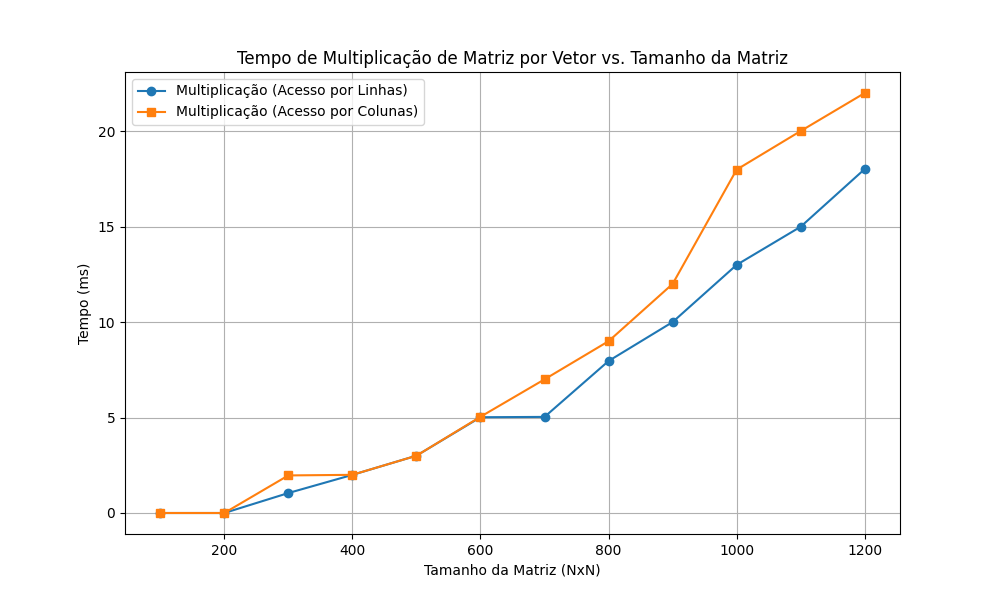

	

<h3 align="center">UNIVERSIDADE FEDERAL DO RIO GRANDE DO NORTE</h3>
<h4 align="center">DEPARTAMENTO DE ENGENHARIA DE COMPUTAÇÃO E AUTOMAÇÃO</h4>
<h4 align="center">DCA3703 - PROGRAMAÇÃO PARALELA</h4>

<h2 align="center">ANÁLISE DE DESEMPENHO: MULTIPLICAÇÃO MATRIZ-VETOR E CACHE</h2>

	<strong>Discente:</strong> Minnael Campelo de Oliveira 
	<strong>Docente:</strong> Samuel Xavier de Souza 
	Natal/RN 
	2025

---

## Objetivo

Este projeto tem como objetivo analisar o impacto do padrão de acesso à memória na multiplicação de matriz por vetor (MxV) em C++, comparando o desempenho entre o acesso por linhas e por colunas, e relacionando os resultados com o funcionamento da memória cache dos processadores modernos.

## Descrição do Problema

A multiplicação de matriz por vetor é uma operação fundamental em computação científica e aplicações de alto desempenho. O tempo de execução dessa operação pode variar significativamente dependendo de como os dados são acessados na memória, devido à hierarquia de cache dos processadores.

São comparadas duas abordagens:

- **Acesso por Linhas:** Percorre a matriz linha por linha (linha externa, coluna interna).
- **Acesso por Colunas:** Percorre a matriz coluna por coluna (coluna externa, linha interna).

O acesso por linhas tende a ser mais eficiente devido à localidade espacial, pois os elementos sequenciais são carregados em blocos para a cache. O acesso por colunas pode causar mais falhas de cache, aumentando o tempo de execução.

## Metodologia

O código foi implementado em **C++**, utilizando as bibliotecas `<vector>` para estrutura de dados e `<chrono>` para medição precisa do tempo de execução. Foram realizados testes com matrizes quadradas de tamanhos variados (de 100 a 1200 elementos), preenchidas com valores fixos para garantir consistência nos resultados.

### Estrutura do Código

O projeto está dividido em duas versões principais:

- `matrixvector.cpp`: Implementa a multiplicação de matriz por vetor, medindo o tempo de execução para os dois padrões de acesso (linhas e colunas), além de calcular o espaço ocupado na memória.
- `tarefa01.cpp`: Realiza testes de desempenho para diferentes tamanhos de matrizes, comparando os tempos de execução entre os dois métodos e apresentando os resultados.

Funções principais:

- `multiplicadorMatrizes`: Realiza a multiplicação MxV, alternando entre acesso por linhas e por colunas conforme o parâmetro.
- `matrizTransposta`: Gera a matriz transposta para facilitar o teste de acesso por colunas.
- Medição do tempo de execução usando `high_resolution_clock`.

### Inicialização dos Dados

	
	

Os vetores e matrizes são inicializados com valores fixos (100) para garantir uniformidade nos testes. O vetor de testes define os tamanhos das matrizes a serem avaliadas.

## Resultados

O tempo de execução de cada abordagem é medido em nanosegundos ou milissegundos, dependendo do teste. Os resultados mostram que o acesso por linhas é mais eficiente, especialmente para matrizes maiores, devido à melhor utilização da cache.

	

O gráfico acima ilustra a diferença de desempenho entre os métodos, evidenciando o impacto do padrão de acesso à memória.

## Conclusão

Os experimentos confirmam que o padrão de acesso à memória influencia diretamente o desempenho da multiplicação de matriz por vetor. O acesso por linhas, por aproveitar melhor a localidade espacial, resulta em menos falhas de cache e maior eficiência, especialmente em matrizes grandes. O acesso por colunas, por outro lado, é penalizado pelo layout de memória, tornando-se menos eficiente.

## Código-Fonte

O código completo está disponível em:

	<a href="https://github.com/Minnael/PROGRAMACAO-PARALELA/tree/master/TAREFA%201"><strong>Repositório GitHub</strong></a>

---

	<strong>Universidade Federal do Rio Grande do Norte</strong> 
	<strong>Departamento de Engenharia de Computação e Automação</strong> 
	<strong>DCA3703 - Programação Paralela</strong>

